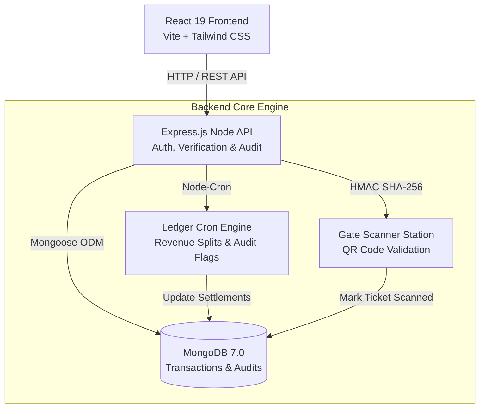

<div align="center">

# 🎬 CineLedger
### Enterprise Movie Ticketing & Auditable Box-Office Verification Engine

[](LICENSE)
[](https://nodejs.org)
[](https://react.dev)
[](https://vitejs.dev)
[](https://www.mongodb.com)
[](https://www.docker.com)

**CineLedger** is a full-stack, enterprise-grade movie ticketing and auditable box-office verification platform. It solves critical entertainment industry challenges—such as ticket scalping, unaccounted box-office revenue leaks, and double-booking discrepancies—via atomic seat locking, SHA-256 HMAC cryptographic QR verification, and automated revenue ledger aggregation.

[Key Features](#-key-features) • [Architecture](#-system-architecture) • [Role Matrix](#-role-based-access-control-rbac) • [Demo Login Presets](#-demo-login-presets) • [Quick Start](#-quick-start) • [API Reference](#-api-reference)

</div>

---

## 📋 Table of Contents

- [Overview](#-overview)
- [Key Features](#-key-features)
- [System Architecture](#-system-architecture)
- [Role-Based Access Control (RBAC)](#-role-based-access-control-rbac)
- [Demo Login Presets](#-demo-login-presets)
- [Technology Stack](#-technology-stack)
- [Repository Structure](#-repository-structure)
- [Quick Start Guide](#-quick-start-guide)
  - [Option 1: Docker Compose (Recommended)](#option-1-docker-compose-recommended)
  - [Option 2: Local Development Setup](#option-2-local-development-setup)
- [API Reference Overview](#-api-reference-overview)
- [License](#-license)

---

## 💡 Overview

In traditional cinema box-office tracking, revenue leaks and discrepancies frequently occur between third-party ticketing platforms, theatre operators, and film producers. **CineLedger** acts as a unified digital verification layer:

1. **Atomic Seat Lock & Reservation**: Eliminates race conditions during high-demand movie release windows.
2. **Cryptographic Gate Verification**: Prevents ticket scalping, counterfeit passes, and double entries using SHA-256 HMAC signed QR passes.
3. **Transparent Box-Office Auditing**: Automatically aggregates gross seat sales, computes 18% GST deductions, enforces 55/45 Producer-Theatre revenue split contracts, and flags discrepancy alerts.

---

## 🌟 Key Features

### 🔐 Cryptographic QR Gate Verification Scanner
- **Anti-Tampering Proofs**: E-tickets contain HMAC SHA-256 signatures derived from secret keys and pass IDs.
- **Live Gate Scanner**: Built-in camera scanner station with instant sound effects (AudioSynth chimes) and status feedback (`ISSUED` vs `USED`).
- **Anti-Double-Entry**: Instantly rejects re-scanned or duplicate passes at theatre check-in gates.

### 🎟️ Interactive Seat Map & FOV Inspector
- **Real-Time Seat Grid**: Live seat selection with VIP Lounge, Executive, and Standard tiers.
- **Field of View (FOV) Inspector**: Interactive 3D angle and screen sightline preview for accurate seating decisions.
- **Atomic Locking**: Prevents double-booking during concurrent checkout flows.

### 📊 Transparent Box-Office Revenue Aggregation
- **Automated Ledger Cron**: Background cron engine calculates net box-office figures periodically.
- **Financial Audit Splits**: Automated 18% GST calculation and 55/45 Producer-Theatre revenue distribution.
- **Discrepancy Flags**: Highlights divergence whenever reported third-party aggregator figures mismatch verified entry scan logs.

### 📄 Printable Digital Cinema Pass
- Clean printable pass complete with venue details, showtimes, barcode grid, seat assignment, and anti-fraud cryptographic verification stamp.

### ⚡ Instant Demo Role Switcher
- Built-in navbar switcher to seamlessly evaluate the system across **Customer**, **Theatre Admin (POS/Scanner)**, **Producer**, and **Super Admin** views.

---

## 🏛️ System Architecture



---

## 👥 Role-Based Access Control (RBAC)

CineLedger enforces strict access boundaries across four distinct user roles:

| Capability / Feature | Customer | Theatre Admin | Producer | Super Admin |
| :--- | :---: | :---: | :---: | :---: |
| **Movie & Showtime Browsing** | ✅ | ✅ | ✅ | ✅ |
| **Online Seat Booking** | ✅ | ✅ | ❌ | ✅ |
| **POS Box-Office Counter** | ❌ | ✅ | ❌ | ✅ |
| **Gate QR Ticket Scanner** | ❌ | ✅ | ❌ | ✅ |
| **Producer Revenue Analytics** | ❌ | ❌ | ✅ *(Owned Movies)* | ✅ *(All Movies)* |
| **System Governance & Audit Stream** | ❌ | ❌ | ❌ | ✅ |

---

## 🔑 Demo Login Presets

Use these credentials to quickly test all user roles and workflows:

| Role | Email | Password | Primary Scope / Dashboard |
| :--- | :--- | :--- | :--- |
| 🛡️ **Super Admin** | `admin@cineledger.com` | `admin123` | Full Governance, Audit Stream & System Logs |
| 🎬 **Producer (Dharma)** | `producer.karan@cineledger.com` | `producer123` | Box-Office Collections & Revenue Settlements |
| 🎬 **Producer (YRF)** | `producer.aditya@cineledger.com` | `producer123` | Box-Office Collections & Revenue Settlements |
| 🍿 **Theatre Admin (PVR)** | `admin.pvr@cineledger.com` | `theatre123` | POS Counter & Gate Scanner Station |
| 🎟️ **Customer** | `customer@gmail.com` | `customer123` | Movie Browsing & Seat Booking |

---

## 🛠️ Technology Stack

| Layer | Technology | Description |
| :--- | :--- | :--- |
| **Frontend** | React 19, Vite 6, Tailwind CSS v4 | Dynamic UI with Recharts analytics & Lucide icons |
| **Backend** | Node.js v20, Express.js | REST API, JWT Authentication & Security middleware |
| **Database** | MongoDB 7.0, Mongoose ODM | Document storage with ACID transactions & indexing |
| **Scheduler** | `node-cron` | Background job execution for revenue settlements |
| **Security** | Crypto (SHA-256 HMAC), bcrypt, JWT | Anti-tampering ticket signature verification |
| **Containerization** | Docker, Docker Compose | Multi-container development & production deployment |

---

## 📂 Repository Structure

```
CineLedger/
├── backend/
│   ├── adapters/          # External third-party aggregator adapters
│   ├── jobs/              # Node-cron background ledger aggregation jobs
│   ├── middleware/        # JWT auth, audit loggers & validation middleware
│   ├── models/            # Mongoose schemas (User, Ticket, Booking, Collection, etc.)
│   ├── routes/            # Express API endpoint controllers
│   ├── services/          # Core business logic (OTP, City, Notification, AI Chat)
│   ├── seed.js            # Database seeder script for quick initial setup
│   └── server.js          # Express application entry point
├── frontend/
│   ├── src/
│   │   ├── components/    # Reusable UI components & modals
│   │   ├── context/       # React Context state (Auth, City, Theme, Toast)
│   │   ├── pages/         # Page views (Dashboards, Booking, Scan Entry, Seat Map)
│   │   └── utils/         # Audio & helper utilities
│   ├── index.html         # Application HTML entry point
│   └── vite.config.js     # Vite bundler configuration
├── docker-compose.yml     # Orchestration for MongoDB, Backend API & Frontend App
├── README.md              # Project documentation
└── package.json           # Root workspace scripts
```

---

## 🚀 Quick Start Guide

### Prerequisites
- [Docker Desktop](https://www.docker.com/products/docker-desktop/) (for Container setup) **OR**
- [Node.js (v20+)](https://nodejs.org/) & [MongoDB (v7.0+)](https://www.mongodb.com/try/download/community) installed locally.

---

### Option 1: Docker Compose (Recommended)

1. **Clone the repository**:
   ```bash
   git clone https://github.com/themanideep009/CineLedger.git
   cd CineLedger
   ```

2. **Launch all services**:
   ```bash
   docker-compose up --build
   ```

3. **Access the application**:
   - **Frontend App**: [http://localhost](http://localhost) (Port 80 / 5173)
   - **Backend API**: [http://localhost:5000/api/health](http://localhost:5000/api/health)
   - **MongoDB**: `localhost:27017`

---

### Option 2: Local Development Setup

1. **Start Local MongoDB**:
   Ensure MongoDB service is running locally on port `27017`.

2. **Setup & Seed Backend**:
   ```bash
   cd backend
   npm install
   npm run seed     # Populates MongoDB with multi-city demo data & user presets
   npm run dev      # Starts Express backend on http://localhost:5000
   ```

3. **Setup Frontend**:
   ```bash
   cd ../frontend
   npm install
   npm run dev      # Starts Vite frontend on http://localhost:5173
   ```

---

## 🌐 API Reference Overview

| Endpoint | Method | Role Access | Description |
| :--- | :---: | :---: | :--- |
| `/api/health` | `GET` | Public | System health and database connection status |
| `/api/auth/login` | `POST` | Public | User authentication & JWT bearer token issue |
| `/api/movies` | `GET` | Public | Catalog listing of active movies with search & filter |
| `/api/shows` | `GET` | Public | Showtimes filtered by movie ID, theatre, or city |
| `/api/bookings` | `POST` | Authenticated | Create atomic seat reservation & checkout |
| `/api/tickets/verify-scan` | `POST` | Theatre / Admin | Validate HMAC QR code at gate scanning station |
| `/api/collections/summary` | `GET` | Producer / Admin | Aggregated net & gross box-office collections |
| `/api/collections/settlement`| `GET` | Producer / Admin | Tax calculation (18% GST) & Producer/Theatre split |
| `/api/admin/audit-logs` | `GET` | Super Admin | Real-time audit log stream & access trace |

---

## 📄 License

Distributed under the MIT License. See `LICENSE` for more information.

<div align="center">
  <sub>Built with ❤️ for transparent cinema operations and box-office integrity.</sub>
</div>
